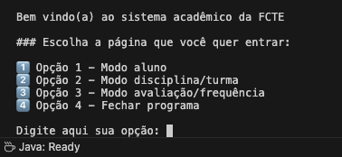
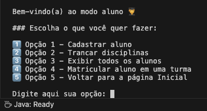
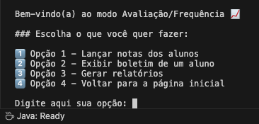
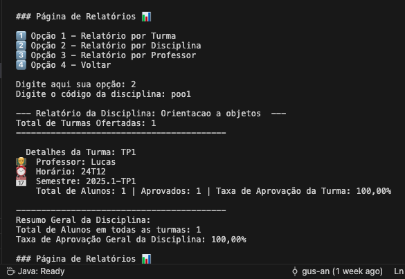

# Sistema Acadêmico - FCTE

## Descrição do Projeto

Desenvolvimento de um sistema acadêmico para gerenciar alunos, disciplinas, professores, turmas, avaliações e frequência, utilizando os conceitos de orientação a objetos (herança, polimorfismo e encapsulamento) e persistência de dados em arquivos.

## Diagrama de ideias iniciais do projeto

.png)

O enunciado do trabalho pode ser encontrado aqui:
- [Trabalho 1 - Sistema Acadêmico](https://github.com/lboaventura25/OO-T06_2025.1_UnB_FCTE/blob/main/trabalhos/ep1/README.md)

## Dados do Aluno

- **Nome completo:** Gustavo Antonio Rodrigues e Silva
- **Matrícula:** 242015380
- **Curso:** Engenharias
- **Turma:** 06

---

## Instruções para Compilação e Execução

1. **Compilação:**  
   Clonar repositorio na IDE, de preferencia VS Code com o comando: 
   `git clone https://github.com/gus-ant/ep1-OO-2025_1_GUSTAVO_ANTONIO.git`

2. **Execução:**  
   Executar o arquivo Main.java no botão `Run Java`

3. **Estrutura de Pastas:**  
```
   ep1-OO-2025_1_GUSTAVO_ANTONIO
   │
   ├── Main.java
   │   
   ├── entidades/              ← Classes de domínio
   │           ├── Aluno.java
   │           ├── AlunoEspecial.java
   │           ├── Avaliacao.java
   │           ├── Frequencia.java
   │           ├── Turma.java
   │           └── Disciplina.java
   | 
   ├─── persistencia/          ← Salvamento de dados
   |           ├─── matrícula_aluno.txt
   |           ├─── disciplinas.txt
   |           └─── turmas.txt     
   | 
   ├─── imagens/               ← Imagens do README.md
   |           ├─── Modo_aluno.png
   |           ├─── Modo_avaliacao.png
   |           └─── Pagina_inicial.png                       
   │
   └── README.md

```

3. **Versão do JAVA utilizada:**  
   `java 21.0.6`

---

## Vídeo de Demonstração

- [\[Link para o vídeo de apresentação rápida no YouTube}\]](https://www.youtube.com/watch?v=pljg22xsYks)

---

## Prints da Execução

1. Menu Principal:  
   

2. Cadastro de Aluno:  
   

3. Relatório de Frequência/Notas:  
   
   
   

---

## Principais Funcionalidades Implementadas

- [x] Cadastro, listagem, matrícula e trancamento de alunos (Normais e Especiais)
- [x] Cadastro de disciplinas e criação de turmas (presenciais e remotas)
- [x] Matrícula de alunos em turmas, respeitando vagas e pré-requisitos
- [x] Lançamento de notas e controle de presença
- [x] Cálculo de média final e verificação de aprovação/reprovação
- [x] Relatórios de desempenho acadêmico por aluno, turma e disciplina
- [x] Persistência de dados em arquivos (.txt ou .csv)
- [x] Tratamento de duplicidade de matrículas
- [x] Uso de herança, polimorfismo e encapsulamento

---

## **Importante**: 

Para garantir padronização e facilitar a leitura e comparação de horários entre turmas, o programa utiliza esse formato para representar os dias, turnos e horários:

### Formato geral: DIASTURNOHORÁRIOS

    DIAS: Dígitos de 1 a 7 representando os dias da semana:

        2 = Segunda-feira

        3 = Terça-feira

        4 = Quarta-feira

        5 = Quinta-feira

        6 = Sexta-feira

        (opcionalmente, 1 = Domingo e 7 = Sábado se necessário)

    TURNO:

        M = Manhã

        T = Tarde

        N = Noite

    HORÁRIOS: Dígitos representando os horários da aula dentro do turno (ex: 1º, 2º, 3º horário...)

#### Exemplos:

   - 23N23: Aulas segunda e terça à noite, nos 2º e 3º horários.

   - 246M24: Aulas segunda, quarta e sexta de manhã, nos 2º e 4º horários.

   - 46T34: Aulas quarta e sexta à tarde, nos 3º e 4º horários.

   - Observação: Turmas com horários conflitantes (mesmo dia, turno e horário) não devem aceitar matrícula duplicada de um mesmo aluno.

### Formato do Semestre:

O formato de semestre segue sempre o padrão:
AAAA.S

   - AAAA: Ano com 4 dígitos (ex: 2024)

   - S: Semestre (1 para o primeiro semestre, 2 para o segundo)

#### Exemplo:

   - 2024.2: Segundo semestre de 2024

   - Somente turmas dentro de um semestre ativo devem permitir matrícula e avaliação.

---

## Observações (Extras e Dificuldades)

## Extras:

- Implementação de tratamento de exceções em todo o menu com `try-catch` e validações por todo o menu para prevenir travamentos do sistema por erros.

- Se arquivos de turmas ou disciplinas não existirem no banco de dados, o sistema os cria automaticamente, garantindo que o sistema continue funcionando mesmo em casos de entrada inválida ou dados ausentes.

- Uso estratégico de emojis nos menus e mensagens para melhorar a experiência do usuário para facilitar a leitura visual e tornar a interação mais intuitiva. Exemplos: `✅ aprovado`, `❌ reprovado`, `📆 semestre`.

- Os dados de alunos, turmas e disciplinas são salvos imediatamente após qualquer modificação, minimizando riscos de perda de dados caso o programa seja encerrado inesperadamente.


## Dificuldades:

- Dificuldade inicial em aplicar boas práticas de separação de responsabilidades dentro do código.

- Muito tempo foi gasto para achar formas sustentáveis de salvar, carregar e modificar as listas de alunos por existirem Alunos normais e especiais.

- Desafio em criar funções reutilizáveis, como `buscarTurmaPorCodigo`, que às vezes retornava null e causava erros em chamadas futuras.

- Inicialmente, dificuldade em extrair e organizar os dados de turmas aprovadas por semestre, tendo necessidade de criar um `Map<String, List<String>>` para classificar por semestre e manipular os dados corretamente.

---

## Contato

- Email: gus.ant.rod.10@gmail.com